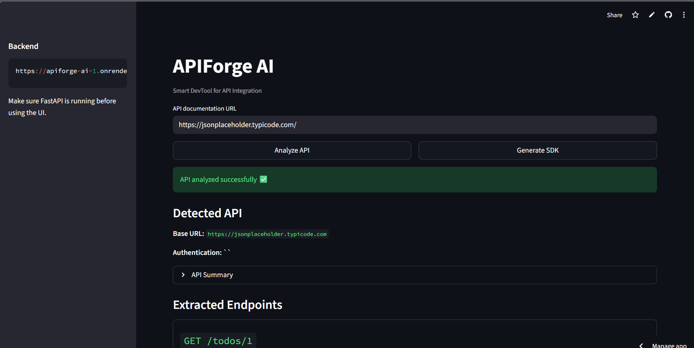
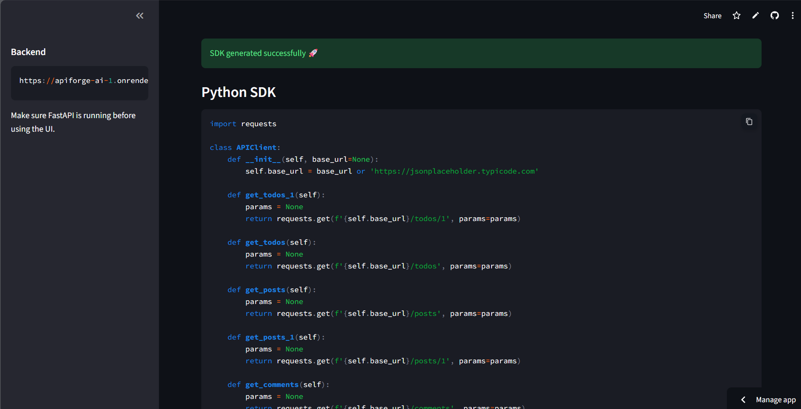
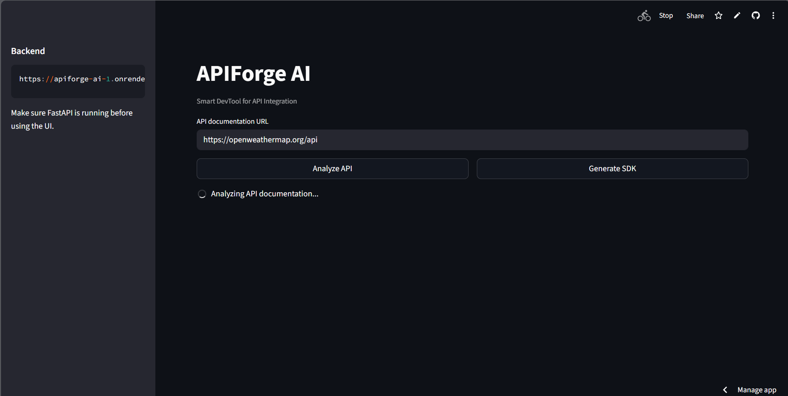
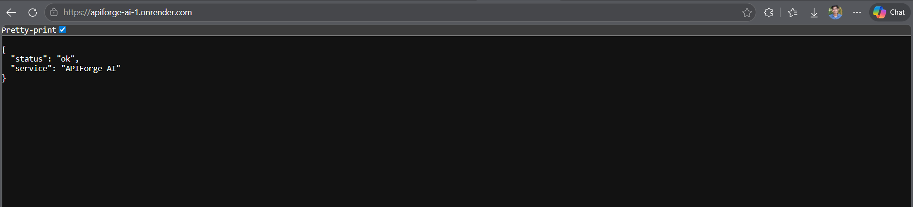

# 🚀 APIForge AI

### Smart DevTool for API Integration

APIForge AI is an AI-powered developer tool that converts any API documentation URL into:

- ✅ Structured API metadata
- 🔐 Authentication detection
- 📡 Extracted endpoints with parameters
- 🧠 AI-powered understanding of API structure
- 🧾 Auto-generated Python SDK (ready to use)

---

## 🌐 Live Demo

- **Frontend:** https://apiforge-ai.streamlit.app
- **Backend:** https://apiforge-ai-1.onrender.com

👉 Paste any API documentation URL and generate SDK instantly.

---

## Screenshots

### 🔹 API Analysis



### 🔹 SDK Generation



### 🔹 Another View



### 🔹 Backend Running Sucessfully



## 🎯 Problem

Developers spend significant time:

- Reading API documentation
- Understanding endpoints and parameters
- Writing boilerplate integration code

👉 APIForge AI reduces this effort from **hours to seconds**.

---

## 💡 Solution

Provide an API documentation URL → APIForge AI will:

1. Scrape and clean the documentation
2. Extract structured API data using LLM
3. Detect authentication type
4. Generate a usable Python SDK automatically

---

## 🧠 Tech Stack

- **Backend:** FastAPI
- **Frontend:** Streamlit
- **LLM:** Groq (`llama-3.1-8b-instant`)
- **Scraping:** `requests` + `BeautifulSoup`
- **Parsing:** Regex + structured normalization
- **Package Manager:** uv

---

## 🏗️ Project Structure

```
apiforge-ai/
├── app/
│   ├── main.py
│   ├── scraper.py
│   ├── parser.py
│   ├── llm.py
│   └── generator.py
├── frontend/
│   └── app.py
├── data/
├── .env
├── pyproject.toml
└── README.md
```

---

## ⚙️ Setup

### 1. Install dependencies

```bash
uv add fastapi uvicorn streamlit beautifulsoup4 requests python-dotenv groq
```

---

### 2. Configure environment variables

Create a `.env` file:

```env
GROQ_API_KEY=your_groq_api_key_here
BACKEND_URL=http://localhost:8000
GROQ_MODEL=llama-3.1-8b-instant
```

---

## ▶️ Run the Project

### Backend

```bash
uv run uvicorn app.main:app --reload
```

### Frontend

```bash
python -m streamlit run frontend/app.py
```

---

## 🧪 Sample Inputs

- https://jsonplaceholder.typicode.com/
- https://openweathermap.org/api
- https://reqres.in/

---

## 🔌 API Endpoints

### `POST /process`

#### Input:

```json
{
  "url": "https://docs.example.com/api"
}
```

#### Output:

```json
{
  "api": {
    "base_url": "https://api.example.com",
    "auth": "API Key",
    "endpoints": [
      {
        "path": "/users",
        "method": "GET",
        "description": "List users",
        "params": ["page", "limit"]
      }
    ]
  },
  "summary": "API successfully analyzed."
}
```

---

### `POST /generate`

#### Input:

```json
{
  "base_url": "https://api.example.com",
  "auth": "API Key",
  "endpoints": []
}
```

#### Output:

```json
{
  "sdk_code": "import requests\n..."
}
```

---

## 🔥 Key Features

- 🚀 One-click API understanding
- 🧠 LLM-powered structured extraction
- 🔐 Authentication detection
- 📡 Hybrid parsing (LLM + fallback)
- ⚡ Fast processing
- 🧾 Auto-generated SDK

---

## 🏆 Demo Flow

1. Paste API URL
2. Click **Analyze API**
3. View extracted endpoints
4. Click **Generate SDK**
5. Use the generated code

👉 This delivers instant developer productivity.

---

## ⚠️ Note

This system extracts structured representations from documentation using AI.
While highly accurate, results may include inferred endpoints for improved usability.

---

## 🚀 Impact

Reduces API integration time from hours to seconds, enabling developers to focus on building features instead of boilerplate code.

## 👨‍💻 Author

Built for hackathon 🚀
Designed for developers ❤️
